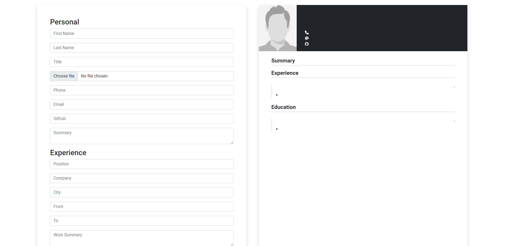
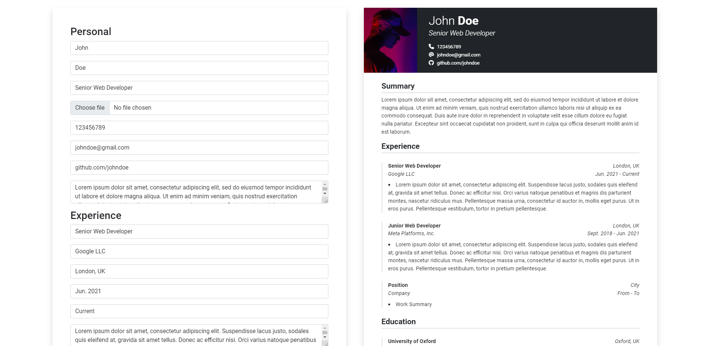
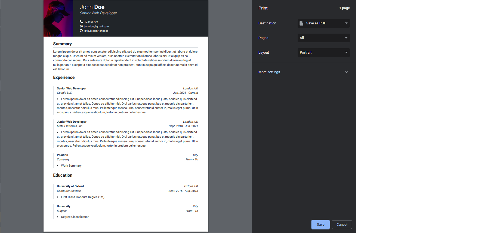

## CV Creator
An application which allows the user to create a CV with a simplistic but appealing design. 

- Live Demo: https://aidenm99.github.io/CV-Creator/

## Technologies Used
This project was built using:
- HTML5
- CSS3
- JavaScript
- React
- Bootstrap
- Sass
- Webpack

## Features
- Upload a profile photo of choice
- Customisable, add or delete sections as needed
- Load an example CV 
- Generate a PDF file to print or save the current CV

## Challenges
This application made heavy use of state and props as well as functional components, concepts which were relatively new to me at the time. Each of these concepts provided 
their own set of challenges, however this project served as an excellent method of working with each of them in a practical manner, ultimately leading me to becoming far
more comfortable with them than I was initially.

Additionally, utilising the FileReader object to allow the user to upload an image from their own device was something which I had never done before. Similarly, allowing
the user to print and/or save the file they create was something which I had never done. Implementing the functionality for these two features wasn't easy but served as a 
great learning experience.

## Screenshots
Empty CV

Example CV

Print or download the pdf

